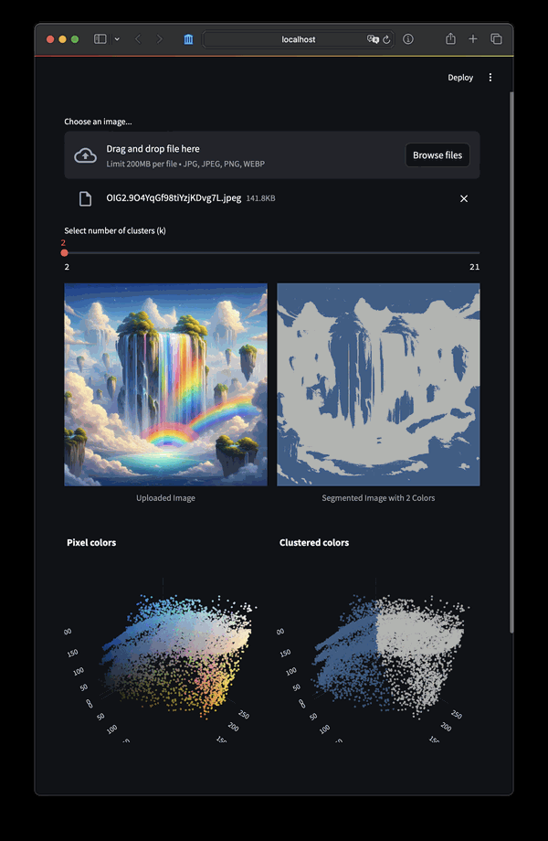

# Image Clustering with K-Means
### Upload an image, choose the number of clusters (k), and explore the segmentation result and RGB scatter plot.



# Installation
```bash
poetry install
```

# Usage
```bash
make run
```
